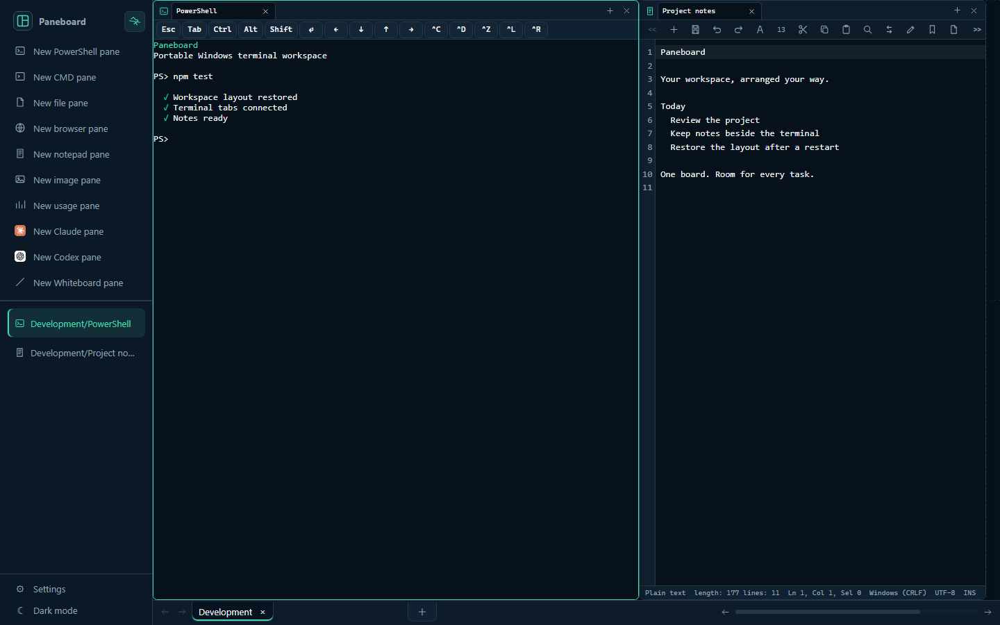
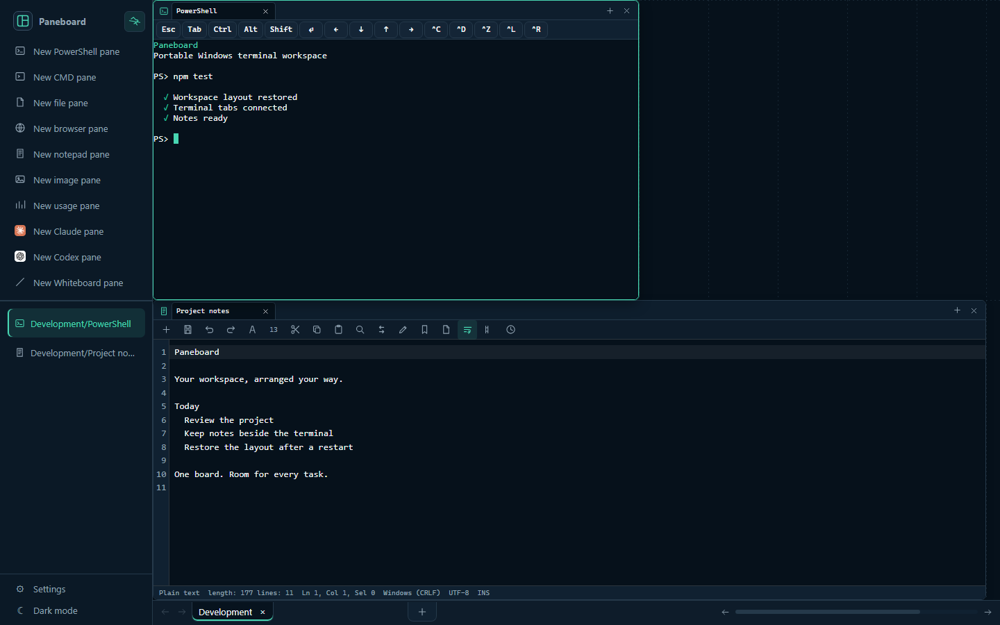
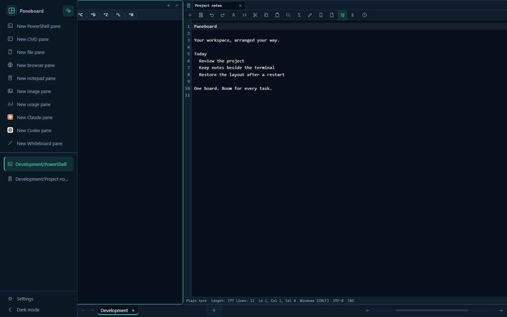
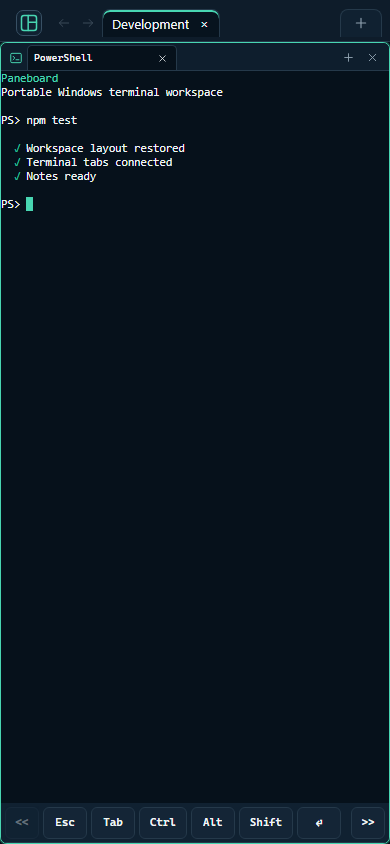

# Paneboard

前身為 WPS7。新版執行檔為 `paneboard.exe`；升級時將原有 `config.toml`、
`data/` 及私人 `plugin-panes/` 保留在執行檔旁。瀏覽器偏好、已儲存的主題及
舊有插件註冊名稱均保留相容性。在新安裝目錄執行 `npm run startup:repair`
可更新登入時啟動的捷徑。GitHub repository 網址沿用現有名稱。

繁體中文 | [English](README.md)

可攜式的 Windows 與 Linux 網頁終端工作區，設計概念來自 `tmux-continuum`。它把 PowerShell
（Linux 上為 bash）工作階段、檔案管理員、記事本、瀏覽器窗格、圖片檢視器與白板提供給本機上的任何瀏覽器
使用，並在重新開機後重建原本的版面配置。

> [!WARNING]
> **Paneboard 等於把 PowerShell 和整個檔案系統開放給網頁瀏覽器存取。**
> 任何人只要能連到監聽的連接埠並通過驗證，就能以執行伺服器的帳戶身分執行任意指令。
>
> 預設設定綁定在 `127.0.0.1` 且不設密碼，這是為了單人桌面使用而設計的。
> **在把 `server.host` 改成 `0.0.0.0` 之前，請先設定一組強密碼** —— 安裝程式之所以
> 拒絕在沒有 `auth.password_hash` 的情況下把 Paneboard 暴露到區域網路，正是這個原因。
>
> 目前沒有 TLS。在區域網路上，密碼、工作階段權杖以及所有終端輸出都是以明文傳輸的。
> 若要用在信任網路以外的環境，請把 Paneboard 放在能終結 TLS 的反向代理後面。
> 詳見 [SECURITY.md](SECURITY.md)。

以下截圖使用示範工作區內容。



## 配合任務調整的工作區

每個窗格都可以在可自訂的格線上獨立移動和調整大小。你可以拉闊終端、把檔案管理員
疊在記事本上方，或讓白板佔滿整個高度；Paneboard 會保留版面和每個窗格的工作目錄。



桌面工作區的右邊沒有固定界線。新增窗格或把窗格移到更右的位置時，畫布會繼續橫向
延伸；底部捲動列讓你在不同窗格群組之間移動，不需要縮窄已經排好的窗格。



同一個工作區在手機瀏覽器上一次顯示一個窗格，並附上一排觸控鍵盤沒有的按鍵：



## 適合的使用場景

**在自己的電腦上執行。** 維持預設的 `127.0.0.1`，把 Paneboard 當成本機工作台：終端、
檔案、筆記和白板都在一個瀏覽器分頁裡，版面在每次重新開機後自動還原，所有資料都
不會離開這台機器。

**在長開的機器上執行，透過 VPN 連入。** 把 Paneboard 裝在放著你的專案與 CLI 登入憑證
的那台機器上 —— 家用伺服器、閒置的桌機、或一台 Windows 虛擬機 —— 再把它加入一個
私有網路（WireGuard、Tailscale，或公司的 VPN）。其他裝置只要開瀏覽器就能進入同一個
工作區：筆電、平板或手機都可以操作跑在那台機器上的 Codex 與 Claude Code 工作階段、
盯著長時間的建置跑完、瀏覽該機器的檔案系統，用戶端完全不用安裝任何東西。

VPN 補上的正是 Paneboard 沒有提供的部分。程式本身沒有 TLS，因此加密流量的是通道，
決定誰連得到這個連接埠的則是那個私有網路。請把 `server.host` 設為 `0.0.0.0`，
VPN 網卡才會被涵蓋（Paneboard 只接受 `127.0.0.1` 和 `0.0.0.0` 這兩個值），
**並且設定一組強密碼**，同時在所有對外網路介面上保持連接埠關閉。用 VPN 的 IP
位址連入可以直接運作；若要用主機名稱（例如 Tailscale 的 MagicDNS 名稱），就必須
把它列進 `server.allowed_hosts`，否則 `Host` 檢查會擋下請求。

## 下載

請到[發行頁面](../../releases)下載 `paneboard-<版本>-windows-x64.zip`。GitHub 一併產生的
「Source code」壓縮檔只包含原始碼，裡面沒有 `paneboard.exe`。

請先把整個 zip 解壓縮到資料夾，再連按兩下 `paneboard.exe`。直接在 Windows 的壓縮檔檢視器
裡開啟任何檔案，只會把那一個檔案解到暫存目錄，其餘檔案仍留在壓縮檔內。

Paneboard 沒有程式碼簽章，因此下載回來的版本第一次執行時 SmartScreen 會提出警告。請先用
`SHA256SUMS.txt` 比對 SHA256，然後在解壓縮前清除下載標記 —— 對 zip 按右鍵、開啟內容、
勾選「解除封鎖」、按確定。或者自己先執行一次 `paneboard.exe`，選擇「更多資訊」再選「仍要
執行」；取消該提示正是啟動器回報 `800704C7` 的原因。

## 從原始碼執行

```powershell
npm install
npm start
```

程式會建立 `config.toml` 與 `data/state.json`，並開啟 `http://127.0.0.1:5000`。

執行打包後的版本時，`config.toml`、`data/` 與記錄檔會放在執行檔旁邊。

## 登入時自動啟動

若要讓 Paneboard 在你每次登入時自動啟動：

```powershell
npm run startup:install
```

這會建立指向 `paneboard.exe` 的 `Startup\paneboard.lnk`。Paneboard 便以你的身分、在你自己的工作階段
中執行，系統匣圖示也顯示在那裡。

在你的工作階段中執行，其他功能才成立：從終端窗格啟動的 GUI 程式會出現在你的桌面上，
窗格繼承到的是你的對應磁碟機與環境變數，用量窗格也找得到你 profile 裡的 Codex 與
Claude Code 登入。Windows 服務做不到這些，因為服務執行於工作階段 0，既沒有互動桌面，
也是以它自己的帳戶執行。

這裡沒有任何步驟需要系統管理員權限。安裝只有兩種情況會要求提權：移除舊版所安裝的服務，
以及在 `server.host = "0.0.0.0"` 時開啟防火牆連接埠。

系統匣圖示提供開啟網頁介面、立即儲存、重新啟動 Paneboard、檢視記錄、診斷與結束。「結束」會
儲存狀態並停止伺服器。

若 Paneboard 仍在執行但圖示消失了，它會在數秒後自動重新啟動；連續五次啟動失敗則不再重試。
每一次嘗試都會記錄在 `data/runtime.log`。

如果你為了區域網路存取而設定 `server.host = "0.0.0.0"`，請先設定一組強度足夠的網頁密碼。
安裝程式在沒有 `auth.password_hash` 的情況下會拒絕把 Paneboard 暴露到區域網路，因為這個程式
提供的是瀏覽器對 PowerShell 的存取權。

若要移除啟動捷徑，以及舊版服務安裝殘留的任何項目：

```powershell
npm run startup:uninstall
```

## 打包

```powershell
npm run package:win
```

打包後的執行檔會輸出到 `dist/paneboard.exe`。pkg 是以主控台子系統（console subsystem）的
Node 執行檔為基底建置的，那會讓伺服器在整個執行期間都掛著一個主控台視窗，因此打包時會
把 PE 子系統改寫成 `windows`。連按兩下 `dist/paneboard.exe` 就會在沒有主控台視窗的情況下啟動。

## Linux 伺服器

Paneboard 亦可以在裝有 Node.js 22 的 Linux 伺服器上執行（已在 Fedora 44 x86-64 測試）：

```sh
npm install
npm start
```

終端窗格會啟動 `bash -l`；如要改用其他 shell，請修改 `shell.preferred`、`shell.fallback` 與 `shell.args`。Linux 上沒有 CMD 窗格，檔案窗格由 `/` 及家目錄開始瀏覽，下載資料夾需要 `zip` 指令。瀏覽器窗格需要 Google Chrome 或 Chromium（例如 `sudo dnf install chromium`）。Linux 上沒有系統匣圖示，Paneboard 以背景服務形式執行。

如要打包成單一執行檔並以 systemd 使用者服務執行，請在 Linux 機器的專案資料夾內執行：

```sh
npm run package:linux
sh dist-linux/scripts/install-paneboard-service.sh
```

安裝程式會寫入 `~/.config/systemd/user/paneboard.service` 並啟動服務，同時啟用 lingering，讓登出後仍繼續執行。它會記錄當下的 `PATH`，所以請在找得到 `claude` 與 `codex` 的 shell 中執行。移動資料夾後請再執行一次。從網頁介面重新啟動時會交由 systemd 處理；`systemctl --user stop paneboard` 會先儲存工作區。`sh dist-linux/scripts/uninstall-paneboard-service.sh` 會移除服務，但保留 `data/`。

## 插件窗格

插件窗格是可獨立安裝或分享的私人擴充，不需要修改應用程式原始碼。資料夾格式、manifest、
安裝步驟與沙箱限制請參閱[插件窗格](docs/plugin-panes.zh-TW.md)。

## 還原機制

Windows 在重新開機後無法還原任意行程的記憶體內容。Paneboard 會儲存工作區、窗格、工作目錄
中繼資料、終端捲動緩衝以及最後一個指令的提示。重新啟動時它會重建窗格，但只會自動重跑
列在 `restore.allowlist` 中的指令。

## PowerShell

Paneboard 優先使用 `pwsh.exe`，找不到時才退回 `powershell.exe`。若使用了退回選項，網頁介面
會顯示建議安裝 PowerShell 7 的提示。

## AI 窗格

AI 窗格會驅動這台機器上已登入的 Claude Code 或 Codex CLI，並把對話呈現為訊息，而不是
終端機輸出。AI 的思考過程與工具呼叫各自可以用開關摺疊起來；當 AI 申請權限或反問你時，
它提供的選項會變成可以點的按鈕——那是 CLI 自己原本就會顯示的選項，不是我們自己編的
是／否。

輸入 `/` 會列出這個 CLI 真正能執行的斜線指令，並附上每個指令的說明與需要的參數——清單
由該工作階段自己回報，所以你自己的 skills 與自訂指令，連同內建的 `/compact`、`/context`、
`/model` 都在裡面。那個參數提示很重要：`/model` 與 `/effort` 要帶值才會生效（例如
`/model haiku`、`/effort high`），單獨輸入在這裡不會有任何反應，因為那會開一個由終端機
繪製的選擇器。至於行為屬於
CLI 自身終端機的指令（例如 `/plan`、`/status`）在這裡並不存在：它們不會出現在清單裡，
打了也會直接告訴你，而不是送出去再讓模型回一句「無法使用」。Codex 沒有提供這種清單，
所以它的分頁不會有指令補全。

側邊欄為每個 CLI 各設一個入口，按一下就能開 Claude 或 Codex 窗格。它像 PowerShell 窗格
一樣支援多個分頁，每個分頁都是獨立的對話、各自有自己的 CLI 行程；在既有分頁旁邊新開的
分頁會沿用同一個 CLI，所以一個窗格可以放幾段 Claude 對話，另一個窗格放 Codex。

每個分頁還有自己的工作資料夾，顯示在工具列的 CLI 名稱旁邊。AI 從那裡啟動、指令也在那裡
執行，所以你可以讓一個分頁對著某個程式庫、另一個分頁對著完全不同的位置。點一下資料夾就能
瀏覽並改成別的；改動會讓該分頁的 CLI 在新資料夾重新啟動，對話則會保留。

對話會跟著工作區一起儲存，並接回 CLI 自己的工作階段，重啟後可以接著談。每個分頁都有
「清除」按鈕，會刪掉該分頁的訊息並讓 AI 從零開始，不再記得那些內容。

時鐘按鈕會列出該 CLI 在這個資料夾已經記錄的對話——包括在終端機裡開始的，或這個窗格
後來忘掉的——選一個就能讓分頁接回去。`/resume` 本身在 CLI 自己的終端機以外無法派送，
所以窗格改用這份清單。之前的訊息留在 AI 那邊，不會在這裡重畫，因此分頁只會顯示一行
說明它現在接的是哪一段對話，然後繼續談下去。

AI 反問你時，它提供的選項會變成按鈕，另外還有一個「其他」可以用自己的話回答——兩個 CLI
本來就接受這種答案，只是不會把它列進選項裡。若 CLI 停掉，分頁會顯示狀態並提供「重試」。

權限詢問預設是關閉的。這是刻意的：同一個工作區裡的終端機窗格本來就能執行你輸入的任何
指令，所以 AI 窗格並沒有給出原本不存在的權限——真正的防線是密碼與 `server.allowed_hosts`，
在 `server.host` 設為 `0.0.0.0` 時尤其重要。設定頁會直接提供每個供應商的額外 CLI 參數。
預設會以 `--permission-mode bypassPermissions --allow-dangerously-skip-permissions` 啟動 Claude
Code，並以 `codex --yolo app-server` 啟動 Codex；若想讓 CLI 詢問權限，請移除或改寫這些參數。
無論哪種設定，AI 自己的提問都一定會顯示。新參數會在開啟新 AI 分頁時生效。

這個窗格需要 Paneboard 在登入時繼承到的 PATH 裡有該 CLI；如果 `claude` 或 `codex` 裝在 npm 的
全域資料夾而窗格找不到，請把該資料夾加進 `config.toml` 的 `shell.extra_path`。

## 用量窗格

用量窗格顯示你的 Codex、Claude Code 與 MiniMax 方案還剩多少額度。這些數字是在執行
Paneboard 的機器上讀取的，來源是那些工具本來就寫在該機器上的憑證：

- `%USERPROFILE%\.codex\auth.json` —— Codex 的 OAuth 存取權杖。
- `%USERPROFILE%\.claude\.credentials.json` —— Claude Code 的 OAuth 存取權杖。
- `config.toml` 中的 `usage.minimax_api_key`，或環境變數 `MINIMAX_CODING_API_KEY`
  / `MINIMAX_API_KEY`。

每一個權杖只會送往它所屬的供應商，而且只用於讀取額度。這些權杖都不會存進
`data/state.json`；`data/runtime.log` 只記錄權杖的長度，不會記錄權杖本身。

當 Paneboard 自己的 profile 裡沒有這些憑證時，查找程序**會搜尋旁邊其他使用者的 profile**，
並採用最近一次登入的那一組。在共用電腦上，這代表只要執行 Paneboard 的帳戶有權讀取該
profile，Paneboard 就可能顯示另一個帳戶的額度。你可以用 `usage.codex_home` 與
`usage.claude_home` 指定固定資料夾，或用 `usage.show_codex`、`show_claude`、
`show_minimax` 關閉個別供應商。這三項預設都是開啟的。

## 參與開發

開發環境設定與儲存庫慣例請參閱 [CONTRIBUTING.md](CONTRIBUTING.md)。安全性問題請依照
[SECURITY.md](SECURITY.md) 的流程私下回報，不要開公開的 issue。

## 授權

MIT —— 詳見 [LICENSE](LICENSE)。

Paneboard 會重新散布第三方程式碼：打包後的執行檔內嵌了所有正式相依套件，而 `public/vendor/`
與納入 Git 的 plugin folder 則附帶預先建置的 Excalidraw、React、xterm.js 以及它們使用的字型。這些元件的授權聲明
彙整在 [THIRD-PARTY-LICENSES.md](THIRD-PARTY-LICENSES.md)，可用
`npm run licenses:generate` 重新產生。固定版本的上游授權檔可以先用
`npm run licenses:sync` 重新下載並核對雜湊。

## 致謝

- [Excalidraw](https://github.com/excalidraw/excalidraw) 提供白板窗格的功能。
- [xterm.js](https://github.com/xtermjs/xterm.js) 提供終端窗格的功能。
- [CodexBar](https://github.com/steipete/CodexBar) 啟發了用量窗格的設計。
